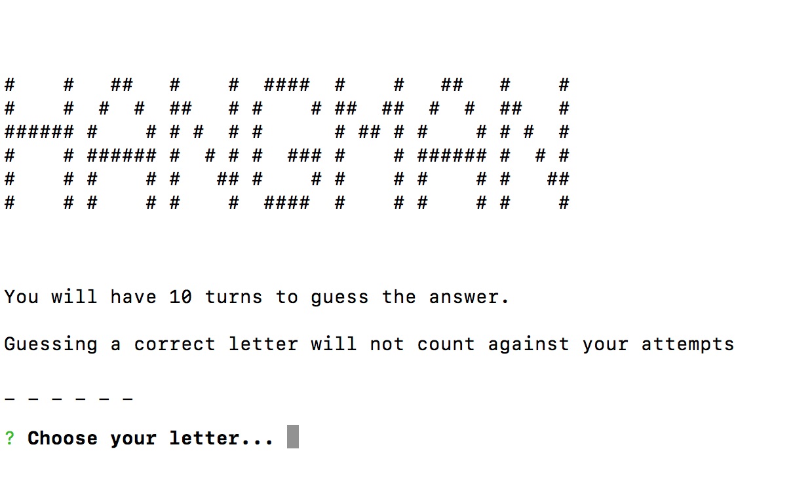
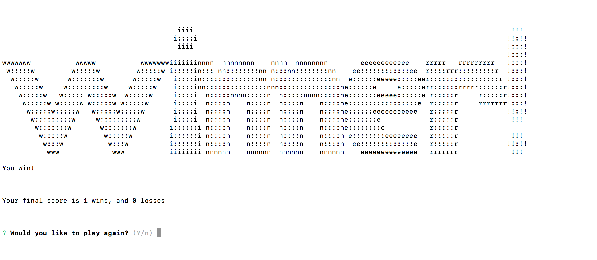
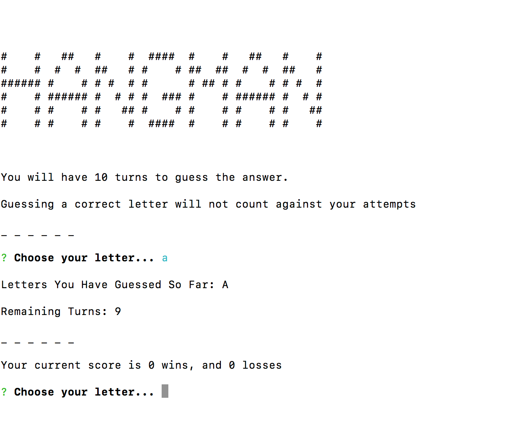
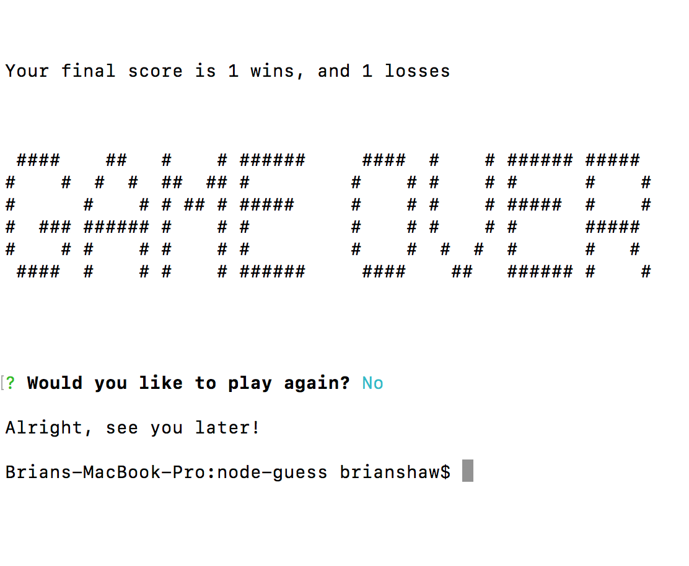

## What is this repo or project?
A constructor Word Guess using advanced javaScript and constructors. 

## Video of Gameplay
https://drive.google.com/file/d/1CXX7mAFoTFxFTWljmZC2IjLgA9adtbmP/view?usp=sharing

## How does it work?
1. The program chooses a random word from a generated word bank. The word bank was created using the NPM Datamuse API. I selected a query based on a "music" search with a 40 word returned limit. Then from these 40 words, 1 is randomly chosen.
2. From the command line a player enters node index.js and the Hangman game will begin. The player is shown that they have 10 attempts to guess the word.
3. Using the NPM Inquirer, the player will be prompted to select a letter.

4. If the guessed letter is part of the hidden word, that corresponding blank will be replaced with that letter and the turn will not count against their attempts.
5. Once the player guesses the entire hidden word before using all 10 turns, the player wins that round and the "Wins" counter will increment by 1. The       game will then prompt the player if they wish to play again or quit.

6. If the guessed letter is not part of the hidden word, the turn will be counted and subtracted from the Remaining Turns.

7. When the player 0 turns, the player will have lost the round. The "Losses" counter will increment by 1 and the player will be prompted if they wish to play again or quit.

## Who will use this repo or project?
**Anyone** who enjoys the sport of hangman or enjoys guessing words based on a music theme.

## What is the goal of this project?
To learn how to use constructor functions and receive user input using the Inquirer package.
